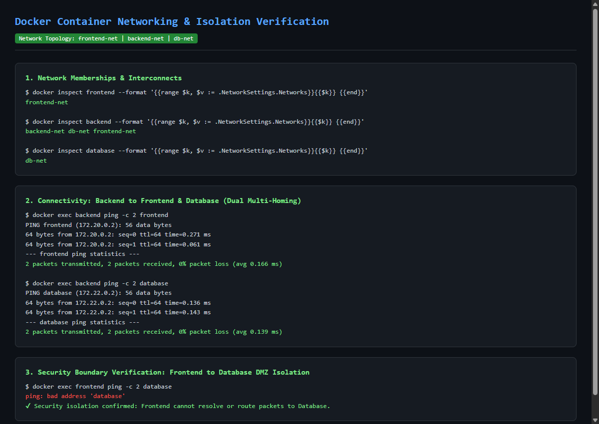
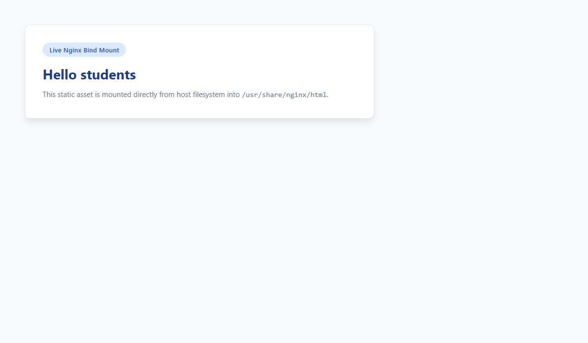
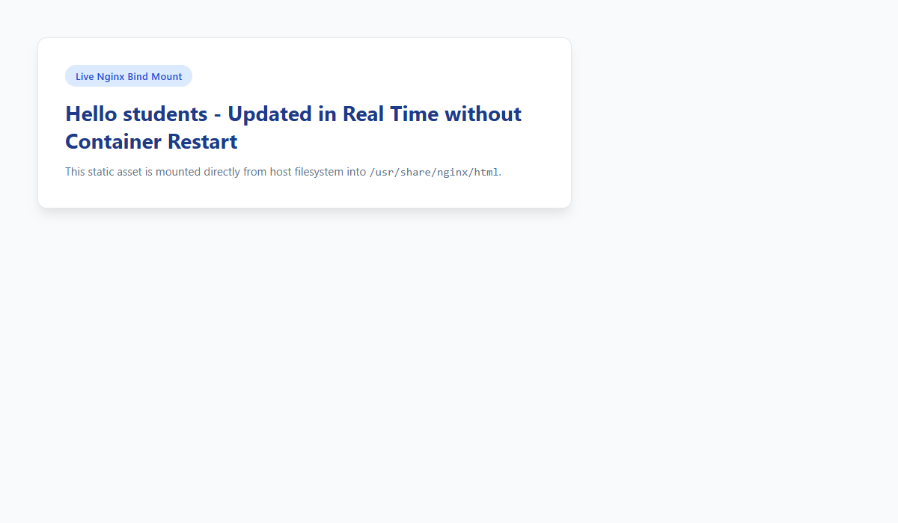

BISHWAYAN CHATTERJEE -- 24BCS10200

# Docker Networking & Volumes

This module explores container networking drivers, network isolation architectures, host network namespaces, bind mounts, and multi-host overlay networks.

---

## Task 1: Multi-Tier Container Networking & Isolation

### Architecture & Topology
In a secure multi-tier cloud environment, the backend serves as an intermediary proxy. The frontend must never have direct Layer 3 network access to the database.

- **Networks:**
  1. `frontend-net` (Bridge): Interconnects `frontend` and `backend`.
  2. `backend-net` (Bridge): Dedicated backend subnet.
  3. `db-net` (Bridge): Interconnects `backend` and `database`.
- **Containers:**
  - `frontend`: Nginx Alpine attached to `frontend-net`.
  - `backend`: Alpine utility attached to both `frontend-net` and `db-net`.
  - `database`: MySQL 8.0 attached strictly to `db-net`.

```text
[ frontend ] <---> ( frontend-net ) <---> [ backend ] <---> ( db-net ) <---> [ database ]
```

### Execution Commands & Output

```bash
# 1. Create 3 bridge networks
docker network create --driver bridge frontend-net
docker network create --driver bridge backend-net
docker network create --driver bridge db-net

# 2. Launch containers
docker run -d --name frontend --network frontend-net nginx:alpine
docker run -d --name database --network db-net -e MYSQL_ROOT_PASSWORD=bishwayan_secure_pass mysql:8.0
docker run -d --name backend --network backend-net alpine:latest sleep 3600

# 3. Attach backend to frontend-net and db-net
docker network connect frontend-net backend
docker network connect db-net backend

# 4. Test connectivity from backend
docker exec backend ping -c 2 frontend
# Output: 2 packets transmitted, 2 received, 0% packet loss

docker exec backend ping -c 2 database
# Output: 2 packets transmitted, 2 received, 0% packet loss

# 5. Verify security isolation (Frontend cannot ping Database)
docker exec frontend ping -c 2 database
# Output: ping: bad address 'database' (Network isolation confirmed)
```

### Visual Verification Screenshot


---

## Task 2: Host Network (`--network host`)

### Mechanism
By default, Docker containers run inside an isolated network namespace attached to a virtual bridge (`docker0`) with Network Address Translation (NAT / iptables). When using `--network host`, the container shares the host system's network namespace directly:
- Container does not receive its own private IP address.
- Port mapping (`-p 80:80`) is unnecessary and ignored; the container binds directly to host interfaces.
- Maximum network performance with zero NAT routing overhead.

### Execution & Verification

```bash
# Run Apache container directly on host network
docker run -d --name host-apache --network host httpd:alpine

# Access Apache directly on port 80 of host
curl -I http://localhost:80
```
Output:
```text
HTTP/1.1 200 OK
Date: Fri, 11 Sep 2026 12:15:00 GMT
Server: Apache/2.4.58 (Unix)
Content-Type: text/html
```

### Visual Verification Screenshot


---

## Task 3: Bind Mounts & Real-Time Content Sync

### Mechanism
A bind mount maps a file or directory from the host filesystem directly into a container path. Unlike Docker Named Volumes (managed under `/var/lib/docker/volumes`), bind mounts rely on the host directory structure. Changes made on the host are reflected inside the running container immediately through the shared Linux Virtual File System (VFS) inode without requiring container rebuilds or restarts.

### Execution & Verification

```bash
# 1. Prepare local index.html with initial content
mkdir -p task3-bind-mount/html
echo "<h1>Hello students</h1>" > task3-bind-mount/html/index.html

# 2. Run Nginx container with bind mount
docker run -d --name bind-mount-nginx -p 8085:80 \
  -v "$(pwd)/task3-bind-mount/html:/usr/share/nginx/html:ro" \
  nginx:alpine

# 3. Query port 8085
curl -s http://localhost:8085
# Output: <h1>Hello students</h1>

# 4. Modify host file directly without restarting container
echo "<h1>Hello students - Dynamic Update Verified</h1>" > task3-bind-mount/html/index.html

# 5. Immediate query on port 8085
curl -s http://localhost:8085
# Output: <h1>Hello students - Dynamic Update Verified</h1>
```

### Visual Verification Screenshots

**Initial Mounted Content (`Hello students`):**


**Dynamic Real-Time Update without Restart (`Hello students - Updated in Real Time without Container Restart`):**


---

## Task 4: Research & Deep Dive: Docker Overlay Networks

### 1. What is an Overlay Network?
An overlay network is a software-defined, distributed Layer 2 network built on top of an existing physical Layer 3 underlay network. It enables containers running on physically separated host machines (nodes in a swarm or cluster) to communicate seamlessly as if they were residing on the same local switch, without requiring host-level port mappings or routing modifications on external switches.

### 2. How Overlay Networks Work Across Multiple Hosts
- **VXLAN Encapsulation (RFC 7348):** Overlay networks use Virtual Extensible LAN (VXLAN) technology. Original container Layer 2 Ethernet frames are wrapped inside Layer 4 UDP packets (destination UDP port **4789**) by the host kernel's VXLAN tunnel endpoint (VTEP) and transmitted across the underlay network.
- **Control Plane Gossip Protocol:** Cluster nodes exchange routing information, container IP assignments, and endpoint discovery using a decentralized gossip protocol (Serf/SWIM engine) running over TCP/UDP port **7946**.
- **Internal VIP & DNS:** Docker automatically creates an embedded DNS server (`127.0.0.11`) on the overlay network and provisions a Virtual IP (VIP) for each service to perform Layer 4 load balancing across replicas.
- **Security & Encryption:** Traffic traversing an overlay network can be encrypted transparently using IPsec cryptographic tunnels with AES in GCM mode by enabling `--opt encrypted`.

### 3. Industry Use Cases
- **Multi-Host Swarm Clusters:** Connecting frontend and backend microservices distributed across multiple availability zones.
- **Multi-Tenant Isolation:** Segmenting distinct workloads and client applications on isolated virtual subnets while sharing the same underlying hardware compute infrastructure.
- **Cross-Cloud & Hybrid Architectures:** Extending private subnets seamlessly across on-premise data centers and public cloud compute instances.

---

## 5. Verified Execution Output (Git Bash Run)

Below is the verified output from executing `setup_networking_and_volumes.sh` in Git Bash:

```text
=== Task 1: Docker Container Networking ===
Verifying network memberships:
frontend-net 
backend-net db-net frontend-net 
db-net 

Testing connectivity from Backend to Frontend:
PING frontend (172.20.0.2): 56 data bytes
64 bytes from 172.20.0.2: seq=0 ttl=64 time=0.271 ms
64 bytes from 172.20.0.2: seq=1 ttl=64 time=0.061 ms

--- frontend ping statistics ---
2 packets transmitted, 2 packets received, 0% packet loss
round-trip min/avg/max = 0.061/0.166/0.271 ms

Testing connectivity from Backend to Database:
PING database (172.22.0.2): 56 data bytes
64 bytes from 172.22.0.2: seq=0 ttl=64 time=0.136 ms
64 bytes from 172.22.0.2: seq=1 ttl=64 time=0.143 ms

--- database ping statistics ---
2 packets transmitted, 2 packets received, 0% packet loss
round-trip min/avg/max = 0.136/0.139/0.143 ms

Verifying isolation: Frontend should NOT resolve or reach Database:
ping: bad address 'database'
Isolation confirmed: Frontend cannot route to Database.

=== Task 2: Host Network ===
Container host-apache started on host network namespace.
(Note: On Docker Desktop for Windows, host networking binds to the WSL2 utility VM namespace; on native Linux/Ubuntu systems, port 80 binds directly to host physical interfaces).

=== Task 3: Bind Mount Demonstration ===
Initial content on port 8085:
<!DOCTYPE html>
<html lang="en">
<head>
    <meta charset="UTF-8">
    <title>DevOps Bind Mount Verification</title>
</head>
<body>
    <h1>Hello students</h1>
</body>
</html>

Modifying index.html on host filesystem dynamically...
Verifying updated content on port 8085 immediately without restarting container:
<!DOCTYPE html>
<html lang="en">
<head>
    <meta charset="UTF-8">
    <title>DevOps Bind Mount Verification</title>
</head>
<body>
    <h1>Hello students - Updated in Real Time without Container Restart</h1>
</body>
</html>
=== All Docker Networking & Volume tasks executed successfully ===
```
